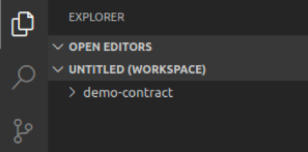
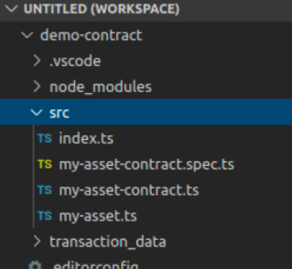
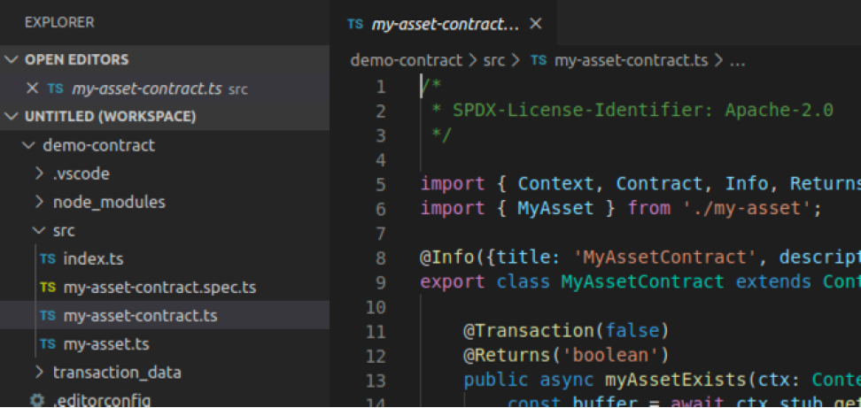

# Creando un Primer Contrato Inteligente

## 1 - Creando el Proyecto

Para poder trabajar los proyectos de contrato inteligente, deberemos abrir nuestro __Visual Studio Code__. Una vez dentro del programa, debemos seleccionar del menú del lado izquierdo la opción del IBM Blockchain Addon como se muestra a continuación:


Debemos tener cuidado en que se muestren las secciones de la herramienta (Smart Contracts, Fabric Environments, etc) ya que si volvemos a hacer click sobre la opción en el menú estas desaparecen o aparecen alternativamente.

Ahora, ya dentro de la herramienta, generaremos un nuevo conjunto de archivos para nuestra aplicación. Dentro de la sección __Smart Contracts__ debemos dar click sobre el icono marcado __"..."__, dentro del sub menú que aparecerá seleccionaremos la opción __"Create New Project"__ como se muestra a continuiación:


Al hacerlo nos aparecerá en la parte superior un nuevo diálogo. Presionaremos la tecla __Intro__ para aceptar la opción por omisión de la siguiente forma:


Acto seguido, aparacerá un nuevo díalogo preguntandonos por el lenguage de programación a usar en el proyecto. En esta ocasión seleccionaremos la opción __TypeScript__ de la siguiente manera


Estas opciones general el andamiaje básico para crear un contrato inteligente centrado sobre el manejo de un único tipo de activo. Luego de ejecutar la herramienta podremos agregar otros tipos de activo. Por ahora nombremos nuestro activo base como __MyAssett__ como se muestra a continuación:


Ahora la herramienta nos pregunta en donde deberemos crear el proyecto. Seleccionemos la opción __Browse__ para navegar en nuestro disco y seleccionar la ubicación donde crearemos nuestro proyecto


Una vez que hemos llegado a la ubicación demos click en el boton de __Crear Nueva Carpeta__ y nombrémosla como __"demo-contract"__. Una vez creada y abierta, demos click en el botón de salvar para que quede este directorio como la raiz de nuestro proyecto.

Ahora nos vulverá a aparecer un diálogo preguntándonos que hacer con el nuevo proyecto. Seleccionarémos la opción __Add to workspace__ como se muestra a continuación:


Al finalizar, el programa construirá los archivos necesarios y luego de un minuto terminará de ejecutar regresando el editor al modo de "manejador de archivos" mostrandonos la creación del espacio de trabajo solicitado de la siguiente forma:



## 2 - Analizando el Proyecto

Ahora procederemos a analizar el proyecto creado por la herramienta. Dentro del menú que aparece al lado izquierdo, expandimos la opcion __demo-contract__ y veremos que ha creado una serie de carpetas y archivos. Acto seguido expandimos la carpeta __src__ en donde la herramienta nos ha dejado el código fuente de nuestra aplicación de la siguiente forma:



El contrato inteligente generado se encuentra dentro del archivo __my-asset-contract.ts__, demos un doble click sobre el archivo __my-asset-contract.ts__ para abrirlo en el editor de la siguiente forma



La primera linea del archivo nos indica que importará la biblioteca de clases básicas para Hyperledger Fabric

```javascript
import { Context, Contract, Info, Returns, Transaction } from 'fabric-contract-api';
```

Un poco más abajo, encontramos la siguiente linea que hace que este programa en typescript sea un contrato inteligente pues nos indica que extenderá la funcionalidad básica de la clase __Contract__

```javascript
export class MyAssetContract extends Contract {
```

el resto de la lógica del programa, contenida entre los {} de la clase __Contract__ consiste en las transacciones del contrato

## 3 - Analizando las Transacciones

Veamos mas a detalle una de estas transacciones. Por ejemplo si analizamos esta función 

```javascript
    @Transaction(false)
    @Returns('boolean')
    public async myAssetExists(ctx: Context, myAssetId: string): Promise<boolean> {
```
Podemos ver que se declara como una transacción al iniciar con el decorador __@Transaction__ de esto podemos derivar que todas aquellas secciones que inicien con el decorador __@Transaction__ serán tratadas como transacciones. Vemos adicionalmente que el decorador viene acompañado de el parámetro __false__ lo que quiere decir que esta transacción no escribirá en el ledger sino que únicamente leerá de este. En caso de que la transacción fuese declarada como __@Transaction(true)__ esto querría decir que la transacción modificará al ledger.

El decorador __@Returns__ nos idica que esta transacción nos regresará un valor, en este caso un valor booleano (cierto o falso) como lo indica el parámetro __"boolean"__

Vemos adicionalmente que la transacción lleva dos parámetros, __myAssetId__ del tipo __string__ y __ctx__ del tipo __Context__. De momento nos fijaremos en la variable __ctx__ pues es una variable especial. La variable de contexto es donde podemos consultar el estado actual de la totalidad de un blockchain, por ejemplo mediante ella podemos conocer los datos de un activo o la existencia de este así como crear y modificar activos.

En el caso particular de esta transacción, usamos la variable de contexto de esta forma

```javascript
const buffer = await ctx.stub.getState(myAssetId);
```

lo que estamos haciendo aquí es pedirle a la variable de contexto __ctx__, que nos proporcione el estado de un activo, mediante __getState()__ donde ese activo se indentifica mediante el valor __myAssetId__. De hecho, la instrucción __getState__ es una instrucción de lectura, motivo por el cual no modifica el ledger y es la razón por la que identificamos al decorador __@Transaction__ con el parámetro __false__

Veamos ahora para comparación la siguiente función:

```javascript
    @Transaction()
    public async createMyAsset(ctx: Context, myAssetId: string, value: string): Promise<void> {
        const exists = await this.myAssetExists(ctx, myAssetId);
        if (exists) {
            throw new Error(`The my asset ${myAssetId} already exists`);
        }
        const myAsset = new MyAsset();
        myAsset.value = value;
        const buffer = Buffer.from(JSON.stringify(myAsset));
        await ctx.stub.putState(myAssetId, buffer);
    }
```

Lo primero que vemos es el decorador __@Transaction()__, aquí llama la atención que no parece haber parámetro, sin embargo esto es lo mismo que poner __@Transaction(true)__ ya que __true__ es su valor por defecto. Esto lo hacemos pues la última linea nos indica:

```javascript
await ctx.stub.putState(myAssetId, buffer);
```
donde invocamos la instrucción __putState()__ que es una instrucción de escritura al contexto. Es por eso que el parámetro del decorador es __true__.

## 4 - Conclusiones

En este laboratorio hemos visto una primera introducción a la creación de contratos inteligentes. Y aunque no hemos escribido aun uno, vimos lo sencillo que resulta creear el andamiaje básico del contrato inteligente usando el __IBM Blockchain Addon__. Vimos así mismo que existen diferencias entre las transacciones que consultan y aquellas que modifican el ledger. Ahora nos resta desplegar este contrato inteligente a una red blockchain para ver su comportamiento y probar su funcionalidad, esto lo haremos en el siguiente laboratoraio.