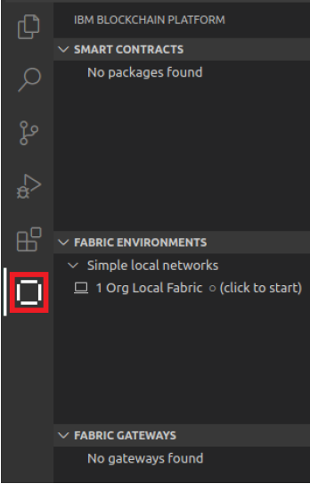
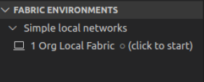
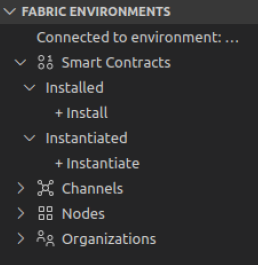

# Desplegando un Contrato Inteligente

Ahora que hemos creado nuestro primer contrato inteligente, nos gustaría probarlo. En este tutorial lo haremos y realizaremos las siguientes actividdades:
- Iniciar una instancia de una red de Hyperledger Fabric en el espacio de trabajo local
- Empaquetar el contrato inteligente que hemos creado previamente
- Desplegar el contrato inteligente a la red Hyperledger Fabric en funcionamiento

Para completar con éxito este tutorial, primero debe haber completado el laboratorio 03: [Crear un contrato inteligente](./laboratorio_03.md). El proyecto debe estar activo en su espacio de trabajo de VS Code.

## 1 -  Inicie el entorno de Hyperledger Fabric de VS Code

Haga clic en el icono de la Plataforma de IBM Blockchain en la barra de tareas para mostrar la barra lateral de Blockchain.

### La Vista de Entornos de Fabric

La extensión IBM Blockchain Platform para VS Code le ayuda a probar sus contratos inteligentes en una red Hyperledger Fabric. La extensión viene con una red pre-configurada de una organización que corre en su máquina local ("1 Org Local Fabric"). Usted puede conectarse a redes remotas también; haremos esto en un tutorial posterior.

Las redes disponibles se muestran en la vista de Entornos de Fabric.

Veremos más adelante cómo esta vista también le permite configurar redes más realistas que también se ejecutan completamente en su máquina local. Esto le permite comprobar que su contrato inteligente es funcionalmente correcto antes de pasar a una configuración de red distribuida más compleja.

Los componentes de Hyperledger Fabric necesarios se descargan e inician automáticamente cuando usted lo selecciona.

## 2 - En la vista de Entornos de Fabric, hacer click en "1 Org Local Fabric O (click to start)"

Esto descargará e iniciará la instancia integrada de Hyperledger Fabric, y puede tardar hasta cinco minutos en completarse.

Cuando Hyperledger Fabric se haya inicializado completamente, la vista cambiará para mostrar los contratos, canales, nodos y organizaciones inteligentes en el entorno local.

Cada uno de estos elementos muestra lo que está configurado en el entorno conectado:
- Los contratos inteligentes muestran los contratos inteligentes que están disponibles. Pueden ser instalados, lo que significa que el código ha sido copiado a los pares, e instanciados, lo que significa que están disponibles para la red.
- Los canales definen el alcance de cada red, y forman un método para elegir cómo las organizaciones comparten los datos. Veremos los canales en un tutorial posterior.
    - Los nodos son los componentes de Hyperledger Fabric que hacen que el sistema funcione. Hay tres tipos de nodos:
    - Los pares que albergan los ledgers y ejecutan contratos inteligentes
    - Los orderers que hacen cumplir la orden de transacción y distribuyen los bloques a sus pares
    - Autoridades de certificación que proporcionan los medios para identificar a los usuarios y organizaciones de la red
- Las organizaciones son los miembros de la red de Blockchain. Cada organización estará formada por muchos usuarios y tipos de usuarios diferentes.
